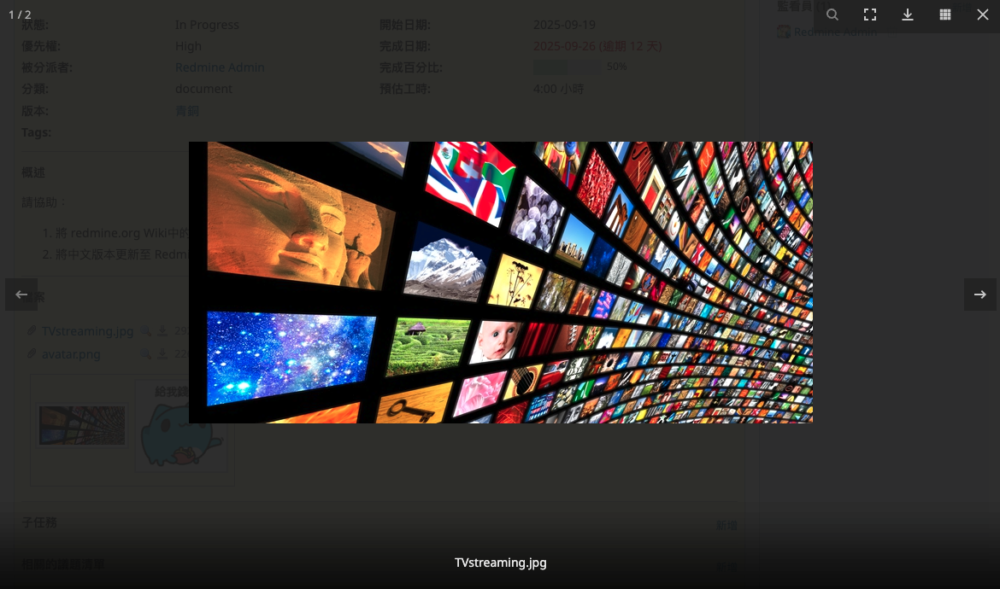
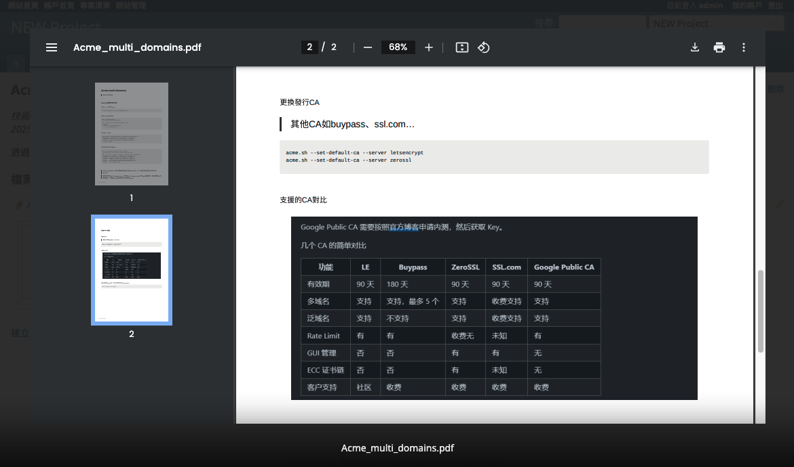

# Redmine Lightbox 3

This plugin lets you preview image (JPG, GIF, PNG, BMP) and PDF attachments in a lightbox.

This is a fork of paginagmbh's [redmine_lightbox2](https://github.com/paginagmbh/redmine_lightbox2) plugin.

This is a fork of zipme's [redmine_lightbox](https://github.com/zipme/redmine_lightbox) plugin.

## Compatibility

**Version 1.0.0 supports Redmine 6.0 or higher**

## Installation and Setup

* Clone or [download](https://github.com/tomy-shen/redmine_lightbox3/releases) this repo into your **redmine_root/plugins/** folder
* If you downloaded a tarball / zip from master branch, make sure you rename the extracted folder to `redmine_lightbox3`
* You have to run the plugin rake task to provide the assets (from the Redmine root directory):
```
$ rake redmine:plugins:migrate RAILS_ENV=production
```
* Restart Redmine

> Due to the update of redmine 6, CSS or javascript probably need to be precompiled after the initial installation. Reference [here](https://www.redmine.org/issues/41754).

## Screenshots





## License

*redmine_lightbox3* plugin is developed under the [MIT License](LICENSE).
